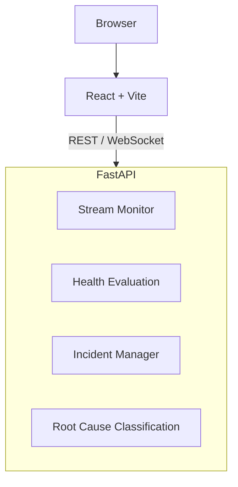

# HLS Stream Operations

**A lightweight platform for monitoring HLS streams, detecting playback issues, and investigating incidents.**

**Live Demo:** [https://hls-stream-ops.onrender.com](https://hls-stream-ops.onrender.com)

---

## Overview

HLS Stream Operations helps engineers answer three specific questions quickly:

1. **Is a stream healthy right now?**
2. **What exactly went wrong when it wasn't?**
3. **Are issues recurring over time?**

This project prioritizes clarity, explainability, and practical diagnostics over exhaustive, deep-packet video analysis. It serves as a bridge between high-level alerts and deep debugging.

## Key Capabilities

### 📡 Stream Monitoring

The system periodically polls HLS manifests and segments to measure real-time performance.

* **Metrics:** Tracks Time to First Byte (TTFB), download time, download ratio (time vs. duration), and error counts.
* **Health States:**
  * 🟢 **GREEN:** Healthy
  * 🟡 **YELLOW:** Degraded (performance issues)
  * 🔴 **RED:** Unhealthy (playback failure)
* **Context:** Every state change includes a human-readable reason.

### 🚨 Incident Detection

Incidents are created automatically to reduce noise.

* Triggered when health hits **RED** or if **YELLOW** persists past a specific threshold.
* Enforces a "one active incident per stream" rule.
* Auto-resolves when the stream returns to **GREEN**.

### 🕵️ Investigation & Timeline

The primary debugging artifact is the Incident Timeline.

* Logs segment successes/failures and health transitions.
* Tracks incident lifecycle (Opened, Acknowledged, Resolved).
* **Visual Context:** Generates thumbnails from video segments so you can *see* the corruption or issue.

### 🧠 Root Cause Classification

Explains *why* a stream failed without using "black box" machine learning. The system uses rule-based logic to classify issues with confidence scores.

* **Classifications include:** Origin/CDN outage, encoder/packager issues, network congestion, edge latency, and intermittent failures.

### 📊 Analysis Mode

Provides historical context using rolling in-memory windows.

* Charts for TTFB, download ratios, and error rates.
* Visualizes health state changes over time.

---

## Architecture

The system uses a decoupled architecture with a FastAPI backend and a React frontend.


## Technology Stack

### Backend

* **Python 3.11**
* **FastAPI**: For high-performance API handling.
* **Asyncio / Aiohttp**: For non-blocking HTTP polling.
* **FFmpeg / FFprobe**: Used for segment probing and thumbnail generation.

### Frontend

* **React + TypeScript**: Type-safe UI components.
* **Vite**: Fast build tool and dev server.
* **Tailwind CSS**: Utility-first styling.
* **Nginx**: Serves the frontend in production containers.

### Infrastructure

* **Docker & Compose**: Containerization.
* **Render / Vercel**: Deployment targets.

---

## Running Locally

### Option 1: Using Docker (Recommended)

This is the easiest way to run the full stack, as it handles the FFmpeg dependency automatically.
```bash
docker compose up --build
```

**Access the services:**

* Frontend: `http://localhost:3000`
* Backend API: `http://localhost:8000`
* API Docs: `http://localhost:8000/docs`

### Option 2: Local Development (Manual)

**Prerequisite:** You must have `ffmpeg` installed on your system path.

**Backend Setup:**
```bash
cd backend
pip install -r requirements.txt
uvicorn app.main:app --reload --port 8000
```

**Frontend Setup:**
```bash
cd frontend
npm install
npm run dev
```

---

## Usage

### Adding a Stream

You can add a stream via the UI or using a CURL command:
```bash
curl -X POST "http://localhost:8000/api/streams?name=TestStream&manifest_url=https://example.com/master.m3u8"
```

*Stream configuration is persisted locally in a JSON file.*

### Core API Endpoints

| Method | Endpoint | Description |
| --- | --- | --- |
| `GET` | `/api/streams` | List all monitored streams |
| `GET` | `/api/streams/{id}` | Get details for a specific stream |
| `POST` | `/api/streams` | Add a new stream to monitor |
| `DELETE` | `/api/streams/{id}` | Stop monitoring a stream |
| `GET` | `/api/incidents` | List all recorded incidents |
| `POST` | `/api/incidents/{id}/acknowledge` | Acknowledge an active incident |
| `GET` | `/api/streams/{id}/metrics/history` | Get historical metric data |

---

## Intentional Limitations

This project is scoped for reliability monitoring and incident diagnosis, not full broadcast compliance. It intentionally excludes:

* MPEG-TS deep analysis (TR-101-290)
* SCTE-35 ad marker parsing
* Audio loudness analysis
* Persistent databases (uses local JSON/memory for simplicity)
* Authentication or multi-tenant support

---

## Author

**Kushal KV**
